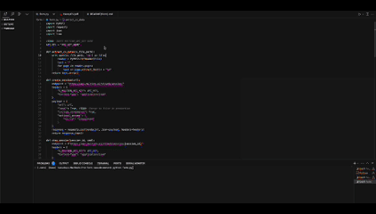

# Form Filling Example

This Python script automates submitting a CV (resume) to an online form. It reads your PDF CV, fills out a web form, and submits it automatically.

This example demonstrates direct interaction with the API endpoints. Alternatively, you can use the MultiOn SDK in your preferred programming language. For more information, refer to the [MultiOn Quickstart](https://docs.multion.ai/quick-start) documentation.

<div style="width: 100%; height: 0; padding-bottom: 56.25%; position: relative;">
  <a href="https://drive.google.com/file/d/1o83ADOST3pN4xHke44ITth1nJ4P9gk3L/view?usp=sharing" target="_blank">
    
  </a>
</div>

Click on the gif above to view the full video demonstration.

## MultiOn Documentation

This example demonstrates direct interaction with the API endpoints. Alternatively, you can use the MultiOn SDK in your preferred programming language. For more information, refer to the [MultiOn Quickstart](https://docs.multion.ai/welcome) documentation.

## What You Need

- Python 3.x
- MultiOn API key
- OpenAI API key
- Python packages: PyPDF2, requests, openai
- URL of the form you're submitting to

## How to Use

1. Put your CV (PDF) in the same folder as the script.
2. Install required packages:
```bash
pip install PyPDF2 requests openai
```
3. Add your MultiOn API key to the script:
```python
API_KEY = "your_multion_api_key_here"
```
4. Add your OpenAI API key to the script:
```python
client = OpenAI(api_key='your_openai_api_key_here')
```
5. Update the CV file name in the script:
```python
cv_text = extract_cv_data('YourCV.pdf')
```
6. Set the URL of the form you're submitting to:
```python
url = "https://your-form-url-here.com"
```
7. Run the script:
```bash
python form.py
```
8. The script will automatically fill the form and attempt to submit it.
9. If user input is needed, the script will pause for 60 seconds to allow manual interaction.

## What It Does

1. Reads your PDF CV
2. Creates a session with the online form
3. Extracts form fields
4. Uses OpenAI to structure CV data based on form fields
5. Fills in form fields with info from your CV
6. Checks if all fields are filled correctly
7. Submits the form if everything is filled
8. Closes the session

## Note

- Keep your API keys private
- Make sure to use the correct form URL
- The script might not catch all info from your CV, so be prepared for manual intervention if needed
- For local execution, you need to download the MultiOn Browser Extension and have "API Enabled" in the settings
- The script is set to run in local mode (`local: True`). Change this to `False` for production use.